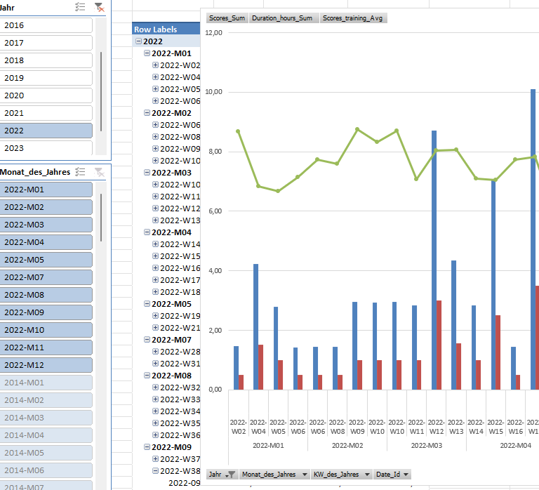

# kettler-training-data

## about

- the aim of this repo is to process and store `.xml` based training data from kettler `SJ10X SKYLON 5`
- it comprises concurring approaches for processing: `azure-data-facory` and `net-core-webapp`

## processing

### azure-data-facory

- `.xml` files are uploaded into the `azure-data-facory` via azure blobs
- [](https://azure.microsoft.com) pipeline transforms xml structures into sql tables

```python
📦src
 ┣ 📂azure
 ┃ ┣ 📂dataflow
 ┃ ┃ ┣ 📜Spiro_dataflow.json
 ┃ ┃ ┗ 📜YT_flow.json
 ┃ ┣ 📂dataset
 ┃ ┃ ┣ 📜DatasetSqlOrders_out.json
 ┃ ┃ ┣ 📜DelimitedTextDataset_in.json
 ┃ ┃ ┣ 📜JsonTest.json
 ┃ ┃ ┣ 📜KettlerBlobRead.json
```

### net-core-webapp

- files are uploaded into the `net-core-webapp` using a drag and drop web UI
- data are processes with   routines

## analysis

### 1️⃣ using  [](https://www.powerpivot.com/)

> impressions

<br/>

### 2️⃣ using 

- under construction 🚧

> note: probably not. power pivot is still way too strong

## built with

### used modules

- [`dropzone.js`](https://www.dropzonejs.com/)

### used packages

```xml
  <ItemGroup>
    <PackageReference Include="AutoWrapper.Core" Version="4.5.0" />
    <PackageReference Include="Microsoft.AspNetCore.Mvc.Razor.RuntimeCompilation" Version="7.0.2" />
    <PackageReference Include="Microsoft.EntityFrameworkCore" Version="7.0.2" />
    <PackageReference Include="Microsoft.EntityFrameworkCore.InMemory" Version="7.0.2" />
    <PackageReference Include="Microsoft.EntityFrameworkCore.SqlServer" Version="7.0.2" />
    <PackageReference Include="Microsoft.EntityFrameworkCore.Tools" Version="7.0.2">
      <PrivateAssets>all</PrivateAssets>
      <IncludeAssets>runtime; build; native; contentfiles; analyzers; buildtransitive</IncludeAssets>
    </PackageReference>
    <PackageReference Include="DextersLabor" Version="0.9.2" />
  </ItemGroup>
```

