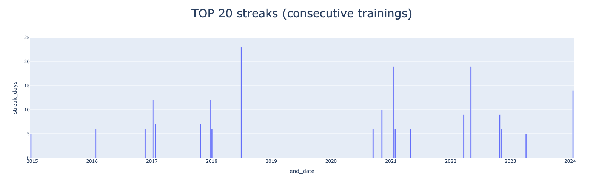

# kettler-training-data

## about

- the aim of this repo is to process and store `.xml` based training data from kettler `SJ10X SKYLON 5`
- it comprises concurring approaches for processing: `azure-data-facory`, `net-core-webapp` and `python`

## technical process


## analysis

### 1️⃣ using  [](https://www.powerpivot.com/)

#### 2023 at a glance

<!-- <br/> -->


#### all years


### 2️⃣ using ![py3.10](https://img.shields.io/badge/python-3.10-blue.svg?logo=data:image/svg+xml;base64,PHN2ZyB4bWxucz0iaHR0cDovL3d3dy53My5vcmcvMjAwMC9zdmciIHZpZXdCb3g9IjAgMCAxMDAgMTAwIj4KICA8ZGVmcz4KICAgIDxsaW5lYXJHcmFkaWVudCBpZD0icHlZZWxsb3ciIGdyYWRpZW50VHJhbnNmb3JtPSJyb3RhdGUoNDUpIj4KICAgICAgPHN0b3Agc3RvcC1jb2xvcj0iI2ZlNSIgb2Zmc2V0PSIwLjYiLz4KICAgICAgPHN0b3Agc3RvcC1jb2xvcj0iI2RhMSIgb2Zmc2V0PSIxIi8+CiAgICA8L2xpbmVhckdyYWRpZW50PgogICAgPGxpbmVhckdyYWRpZW50IGlkPSJweUJsdWUiIGdyYWRpZW50VHJhbnNmb3JtPSJyb3RhdGUoNDUpIj4KICAgICAgPHN0b3Agc3RvcC1jb2xvcj0iIzY5ZiIgb2Zmc2V0PSIwLjQiLz4KICAgICAgPHN0b3Agc3RvcC1jb2xvcj0iIzQ2OCIgb2Zmc2V0PSIxIi8+CiAgICA8L2xpbmVhckdyYWRpZW50PgogIDwvZGVmcz4KCiAgPHBhdGggZD0iTTI3LDE2YzAtNyw5LTEzLDI0LTEzYzE1LDAsMjMsNiwyMywxM2wwLDIyYzAsNy01LDEyLTExLDEybC0yNCwwYy04LDAtMTQsNi0xNCwxNWwwLDEwbC05LDBjLTgsMC0xMy05LTEzLTI0YzAtMTQsNS0yMywxMy0yM2wzNSwwbDAtM2wtMjQsMGwwLTlsMCwweiBNODgsNTB2MSIgZmlsbD0idXJsKCNweUJsdWUpIi8+CiAgPHBhdGggZD0iTTc0LDg3YzAsNy04LDEzLTIzLDEzYy0xNSwwLTI0LTYtMjQtMTNsMC0yMmMwLTcsNi0xMiwxMi0xMmwyNCwwYzgsMCwxNC03LDE0LTE1bDAtMTBsOSwwYzcsMCwxMyw5LDEzLDIzYzAsMTUtNiwyNC0xMywyNGwtMzUsMGwwLDNsMjMsMGwwLDlsMCwweiBNMTQwLDUwdjEiIGZpbGw9InVybCgjcHlZZWxsb3cpIi8+CgogIDxjaXJjbGUgcj0iNCIgY3g9IjY0IiBjeT0iODgiIGZpbGw9IiNGRkYiLz4KICA8Y2lyY2xlIHI9IjQiIGN4PSIzNyIgY3k9IjE1IiBmaWxsPSIjRkZGIi8+Cjwvc3ZnPgo=)



- for more analysis see [jupyter-notebook](src/python/docs/kettler_1_analysis.md)

## backend options

### azure-data-facory

- `.xml` files are uploaded into the `azure-data-facory` via azure blobs
- [](https://azure.microsoft.com) pipeline transforms xml structures into sql tables

```python
📦src
 ┣ 📂azure
 ┃ ┣ 📂dataflow
 ┃ ┃ ┣ 📜Spiro_dataflow.json
 ┃ ┃ ┗ 📜YT_flow.json
 ┃ ┣ 📂dataset
 ┃ ┃ ┣ 📜DatasetSqlOrders_out.json
 ┃ ┃ ┣ 📜DelimitedTextDataset_in.json
 ┃ ┃ ┣ 📜JsonTest.json
 ┃ ┃ ┣ 📜KettlerBlobRead.json
```

### net-core-webapp

- files are uploaded into the `net-core-webapp` using a drag and drop web UI
- data are processes with   routines
