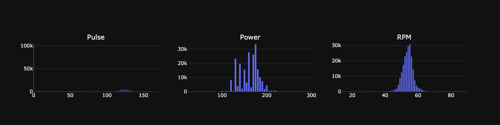
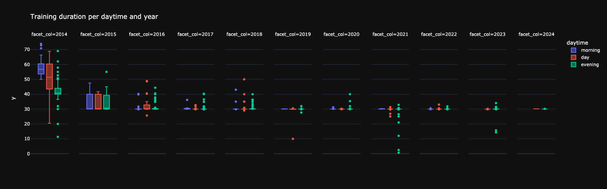

# kettler analysis

## intro code


```python
import os
import sys
import pandas as pd
from pathlib import Path
from textwrap import wrap
import plotly.express as px
import datetime as dt
import requests

exec(requests.get(
    'https://gist.githubusercontent.com/smeisegeier/4944b9a88b7a90cb1b2acc6da0dd906f/raw/'
    ).text)

# * get src directory which *must* be parent
dir_src = Path(os.getcwd()).parent.parent

# # * add to path
# if dir_src.as_posix() not in sys.path:
#     sys.path.append(dir_src.as_posix())

# * display / style settings
pd.options.display.max_rows = 100
pd.options.display.max_colwidth = 160
pd.options.display.precision = 2


# * theme settings
THEME = "dark" # 'light'

if THEME == 'dark':
    THEME_PLOTLY="plotly_dark"
else:
    THEME_PLOTLY="plotly"
```

## load data


```python
df_training=pd.read_parquet('data/trainings.pq')
df_records=pd.read_parquet('data/records.pq')
```

## analysis


```python
describe_df(df_training.iloc[:,1:], 'training', use_columns=False, use_plot=False)
```

    *** training ***
    shape: (1_119, 13) columns: ['Device', 'Calibration', 'Software', 'Date', 'Time', 'RecordIntervall', 'Transmission', 'Energy', 'TrainingDateTime', 'FileName', 'CreatedAt', 'Duration_minutes', 'Streak_days'] 
    duplicates: 0
    ***
    Duration_minutes(114|float64) min: 0.667 | max: 73.833 | median: 30.0 | mean: 32.33 | std: 6.61 | cv: 0.204 | sum: 36_181.833 | skew: 2.57 | kurto: 10.938
    Streak_days(13|int64) min: 0 | max: 23 | median: 1.0 | mean: 1.0 | std: 1.69 | cv: 1.69 | sum: 1_120 | skew: 5.512 | kurto: 51.997
    missings: {'Device': 0, 'Calibration': 0, 'Software': 0, 'Date': 0, 'Time': 0, 'RecordIntervall': 0, 'Transmission': 0, 'Energy': 0, 'TrainingDateTime': 0, 'FileName': 0, 'CreatedAt': 0, 'Duration_minutes': 0, 'Streak_days': 0}


<div>
<style scoped>
    .dataframe tbody tr th:only-of-type {
        vertical-align: middle;
    }

    .dataframe tbody tr th {
        vertical-align: top;
    }

    .dataframe thead th {
        text-align: right;
    }
</style>
<table border="1" class="dataframe">
  <thead>
    <tr style="text-align: right;">
      <th></th>
      <th>Device</th>
      <th>Calibration</th>
      <th>Software</th>
      <th>Date</th>
      <th>Time</th>
      <th>RecordIntervall</th>
      <th>Transmission</th>
      <th>Energy</th>
      <th>TrainingDateTime</th>
      <th>FileName</th>
      <th>CreatedAt</th>
      <th>Duration_minutes</th>
      <th>Streak_days</th>
    </tr>
  </thead>
  <tbody>
    <tr>
      <th>0</th>
      <td>SJ10X SKYLON 5</td>
      <td>07655-350-2007</td>
      <td>3367</td>
      <td>11.01.2014</td>
      <td>20:09:26</td>
      <td>10</td>
      <td>9.5</td>
      <td>6.0</td>
      <td>2014-01-11T20:09:26+01:00</td>
      <td>Training 11.01.2014 20h09m26s.xml</td>
      <td>2021-01-07 23:58:46.053121</td>
      <td>53.17</td>
      <td>0</td>
    </tr>
    <tr>
      <th>1</th>
      <td>SJ10X SKYLON 5</td>
      <td>07655-350-2007</td>
      <td>3367</td>
      <td>12.01.2014</td>
      <td>18:49:44</td>
      <td>10</td>
      <td>9.5</td>
      <td>6.0</td>
      <td>2014-01-12T18:49:44+01:00</td>
      <td>Training 12.01.2014 18h49m44s.xml</td>
      <td>2021-01-07 23:58:46.053121</td>
      <td>56.67</td>
      <td>0</td>
    </tr>
    <tr>
      <th>2</th>
      <td>SJ10X SKYLON 5</td>
      <td>07655-350-2007</td>
      <td>3367</td>
      <td>13.01.2014</td>
      <td>21:56:13</td>
      <td>10</td>
      <td>9.5</td>
      <td>6.0</td>
      <td>2014-01-13T21:56:13+01:00</td>
      <td>Training 13.01.2014 21h56m13s.xml</td>
      <td>2021-01-07 23:58:46.053121</td>
      <td>59.17</td>
      <td>0</td>
    </tr>
  </tbody>
</table>
</div>


```python
describe_df(df_records.iloc[:,1:], 'records', use_columns=False, fig_offset=-4)
```

    *** records ***
    shape: (217_091, 7) columns: ['Pulse', 'Power', 'RPM', 'TimePassed_minutes', 'TimePassed_percent', 'Score_10sec', 'TrainingId'] 
    duplicates: 0
    ***
    Pulse(182|int64) min: 0 | max: 220 | median: 77.0 | mean: 65.01 | std: 64.19 | cv: 0.987 | sum: 14_112_954 | skew: 0.099 | kurto: -1.737
    Power(52|int64) min: 25 | max: 300 | median: 160.0 | mean: 160.17 | std: 23.31 | cv: 0.146 | sum: 34_770_490 | skew: -0.635 | kurto: 2.301
    RPM(61|int64) min: 14 | max: 89 | median: 54.0 | mean: 53.63 | std: 3.56 | cv: 0.066 | sum: 11_642_478 | skew: -0.813 | kurto: 6.273
    TimePassed_minutes(443|float64) min: 0.167 | max: 73.833 | median: 16.33 | mean: 16.92 | std: 10.77 | cv: 0.637 | sum: 3_674_194.833 | skew: 0.694 | kurto: 0.854
    TimePassed_percent(23_272|float64) min: 0.002 | max: 1.0 | median: 0.5 | mean: 0.5 | std: 0.29 | cv: 0.574 | sum: 109_105.0 | skew: -0.0 | kurto: -1.2
    Score_10sec(1_028|float64) min: 0.0 | max: 0.018 | median: 0.01 | mean: 0.01 | std: 0.0 | cv: 0.186 | sum: 1_602.262 | skew: -0.12 | kurto: 1.503
    TrainingId(1_119|int64) min: 1 | max: 1_122 | median: 518.0 | mean: 528.3 | std: 334.27 | cv: 0.633 | sum: 114_688_343 | skew: 0.089 | kurto: -1.243
    missings: {'Pulse': 0, 'Power': 0, 'RPM': 0, 'TimePassed_minutes': 0, 'TimePassed_percent': 0, 'Score_10sec': 0, 'TrainingId': 0}


<div>
<style scoped>
    .dataframe tbody tr th:only-of-type {
        vertical-align: middle;
    }

    .dataframe tbody tr th {
        vertical-align: top;
    }

    .dataframe thead th {
        text-align: right;
    }
</style>
<table border="1" class="dataframe">
  <thead>
    <tr style="text-align: right;">
      <th></th>
      <th>Pulse</th>
      <th>Power</th>
      <th>RPM</th>
      <th>TimePassed_minutes</th>
      <th>TimePassed_percent</th>
      <th>Score_10sec</th>
      <th>TrainingId</th>
    </tr>
  </thead>
  <tbody>
    <tr>
      <th>0</th>
      <td>0</td>
      <td>50</td>
      <td>46</td>
      <td>0.17</td>
      <td>3.13e-03</td>
      <td>1.97e-03</td>
      <td>1</td>
    </tr>
    <tr>
      <th>1</th>
      <td>0</td>
      <td>150</td>
      <td>45</td>
      <td>36.17</td>
      <td>6.80e-01</td>
      <td>5.77e-03</td>
      <td>1</td>
    </tr>
    <tr>
      <th>2</th>
      <td>0</td>
      <td>150</td>
      <td>49</td>
      <td>36.00</td>
      <td>6.77e-01</td>
      <td>6.28e-03</td>
      <td>1</td>
    </tr>
  </tbody>
</table>
</div>


    

    


```python
#
# * tailor and join both tables

# * id col is new index
if "Id" in df_training.columns:
    df_training.set_index("Id", inplace=True, drop=True)
if "Id" in df_records.columns:
    df_records.set_index("Id", inplace=True, drop=True)

# * convert to proper datetime (remove 'T')
df_training.TrainingDateTime=pd.to_datetime(df_training.TrainingDateTime, errors='coerce')

df_training['daytime']=df_training.TrainingDateTime.dt.hour.map(
    lambda x: "morning" if x < 13 else "day" if x < 18 else "evening"
)

# * add day_of_week
df_training['day_of_week']=df_training.TrainingDateTime.dt.strftime('%A')

# * join both tables on records level
df=df_records.join(df_training, on="TrainingId")
df

# * drop unneeded columns: filename, createdat, TrainingId
col_one_item = [col for col in df if len(df[col].unique()) == 1]
print(f"remove these one-item columns:{col_one_item}")

df.drop(
    # * subtract columns to make the statement idempotent
    columns=set(df.columns)
    & (set(["FileName", "CreatedAt", "TrainingId"]) | set(col_one_item)),
    inplace=True,
)

df[:3]
```

    remove these one-item columns:['Device', 'Calibration', 'Software', 'RecordIntervall', 'Transmission', 'Energy']


<div>
<style scoped>
    .dataframe tbody tr th:only-of-type {
        vertical-align: middle;
    }

    .dataframe tbody tr th {
        vertical-align: top;
    }

    .dataframe thead th {
        text-align: right;
    }
</style>
<table border="1" class="dataframe">
  <thead>
    <tr style="text-align: right;">
      <th></th>
      <th>Pulse</th>
      <th>Power</th>
      <th>RPM</th>
      <th>TimePassed_minutes</th>
      <th>TimePassed_percent</th>
      <th>Score_10sec</th>
      <th>Date</th>
      <th>Time</th>
      <th>TrainingDateTime</th>
      <th>Duration_minutes</th>
      <th>Streak_days</th>
      <th>daytime</th>
      <th>day_of_week</th>
    </tr>
    <tr>
      <th>Id</th>
      <th></th>
      <th></th>
      <th></th>
      <th></th>
      <th></th>
      <th></th>
      <th></th>
      <th></th>
      <th></th>
      <th></th>
      <th></th>
      <th></th>
      <th></th>
    </tr>
  </thead>
  <tbody>
    <tr>
      <th>1</th>
      <td>0</td>
      <td>50</td>
      <td>46</td>
      <td>0.17</td>
      <td>3.13e-03</td>
      <td>1.97e-03</td>
      <td>11.01.2014</td>
      <td>20:09:26</td>
      <td>2014-01-11 20:09:26+01:00</td>
      <td>53.17</td>
      <td>0</td>
      <td>evening</td>
      <td>Saturday</td>
    </tr>
    <tr>
      <th>2</th>
      <td>0</td>
      <td>150</td>
      <td>45</td>
      <td>36.17</td>
      <td>6.80e-01</td>
      <td>5.77e-03</td>
      <td>11.01.2014</td>
      <td>20:09:26</td>
      <td>2014-01-11 20:09:26+01:00</td>
      <td>53.17</td>
      <td>0</td>
      <td>evening</td>
      <td>Saturday</td>
    </tr>
    <tr>
      <th>3</th>
      <td>0</td>
      <td>150</td>
      <td>49</td>
      <td>36.00</td>
      <td>6.77e-01</td>
      <td>6.28e-03</td>
      <td>11.01.2014</td>
      <td>20:09:26</td>
      <td>2014-01-11 20:09:26+01:00</td>
      <td>53.17</td>
      <td>0</td>
      <td>evening</td>
      <td>Saturday</td>
    </tr>
  </tbody>
</table>
</div>


```python
_df = df_training
# * add aux cols for sorting
_df['_daytime'] = pd.Categorical(_df.daytime, ["morning", "day", "evening"])
_df['_year'] = _df.TrainingDateTime.dt.year

_fig = px.box(
    _df.sort_values(by=["_year","_daytime"]),
    y=_df.Duration_minutes,
    template=THEME_PLOTLY,
    color='daytime',
    points="outliers",
    # points=False,
    facet_col=_df.TrainingDateTime.dt.year,
    # height=300,
    width=1600,
    title="Training duration per daytime and year",
    )
_fig.show('png')
```


    

    


```python
print('TOP 10 streak days')
df_training.assign(_year=df_training.TrainingDateTime.dt.year).sort_values(by='Streak_days', ascending=False)[['Streak_days','Date','_year']][:10]
```

    TOP 10 streak days


<div>
<style scoped>
    .dataframe tbody tr th:only-of-type {
        vertical-align: middle;
    }

    .dataframe tbody tr th {
        vertical-align: top;
    }

    .dataframe thead th {
        text-align: right;
    }
</style>
<table border="1" class="dataframe">
  <thead>
    <tr style="text-align: right;">
      <th></th>
      <th>Streak_days</th>
      <th>Date</th>
      <th>_year</th>
    </tr>
    <tr>
      <th>Id</th>
      <th></th>
      <th></th>
      <th></th>
    </tr>
  </thead>
  <tbody>
    <tr>
      <th>493</th>
      <td>23</td>
      <td>02.07.2018</td>
      <td>2018</td>
    </tr>
    <tr>
      <th>773</th>
      <td>19</td>
      <td>15.01.2021</td>
      <td>2021</td>
    </tr>
    <tr>
      <th>944</th>
      <td>19</td>
      <td>05.05.2022</td>
      <td>2022</td>
    </tr>
    <tr>
      <th>380</th>
      <td>12</td>
      <td>08.01.2017</td>
      <td>2017</td>
    </tr>
    <tr>
      <th>454</th>
      <td>12</td>
      <td>23.12.2017</td>
      <td>2017</td>
    </tr>
    <tr>
      <th>694</th>
      <td>10</td>
      <td>07.11.2020</td>
      <td>2020</td>
    </tr>
    <tr>
      <th>980</th>
      <td>9</td>
      <td>28.10.2022</td>
      <td>2022</td>
    </tr>
    <tr>
      <th>918</th>
      <td>9</td>
      <td>22.03.2022</td>
      <td>2022</td>
    </tr>
    <tr>
      <th>466</th>
      <td>7</td>
      <td>26.10.2017</td>
      <td>2017</td>
    </tr>
    <tr>
      <th>448</th>
      <td>7</td>
      <td>23.01.2017</td>
      <td>2017</td>
    </tr>
  </tbody>
</table>
</div>


