# kettler analysis

## intro code


```python
import os
import sys
import pandas as pd
from pathlib import Path
from textwrap import wrap
import plotly.express as px
import datetime as dt
import warnings
import requests

exec(
    requests.get(
        "https://gist.githubusercontent.com/smeisegeier/4944b9a88b7a90cb1b2acc6da0dd906f/raw/"
    ).text
)

# * get plotting mods
exec(requests.get(
    'https://gist.githubusercontent.com/smeisegeier/2a3c931c987dbfaa23ff0ca6e9955829/raw/'
    ).text)

# * get src directory which *must* be parent
dir_src = Path(os.getcwd()).parent.parent

# # * add to path
# if dir_src.as_posix() not in sys.path:
#     sys.path.append(dir_src.as_posix())

# * display / style settings
pd.options.display.max_rows = 100
pd.options.display.max_colwidth = 160
pd.options.display.precision = 2
pd.options.mode.chained_assignment = None


# * theme settings
# THEME = "light"
THEME = "light"
os.environ["THEME"] = THEME

if THEME == "dark":
    THEME_PLOTLY = "plotly_dark"
else:
    THEME_PLOTLY = "plotly"

print(f"last run: {dt.datetime.now()}")
```

    last run: 2024-01-27 22:29:01.626659


## load data


```python
df_training=pd.read_parquet('data/trainings.pq')
df_records=pd.read_parquet('data/records.pq')
```

## analysis


```python
describe_df(df_training.iloc[:,1:], 'training', use_columns=False, use_plot=False)
```

    🔵 *** df: training ***
    🟣 shape: (1_125, 13) columns: ['Device', 'Calibration', 'Software', 'Date', 'Time', 'RecordIntervall', 'Transmission', 'Energy', 'TrainingDateTime', 'FileName', 'CreatedAt', 'Duration_minutes', 'Streak_days'] 
    🟣 duplicates: 0
    🟣 missings: {'Device': 0, 'Calibration': 0, 'Software': 0, 'Date': 0, 'Time': 0, 'RecordIntervall': 0, 'Transmission': 0, 'Energy': 0, 'TrainingDateTime': 0, 'FileName': 0, 'CreatedAt': 0, 'Duration_minutes': 0, 'Streak_days': 0}
    --- column uniques (all)
    🟠 Device(1|object)
    🟠 Calibration(1|object)
    🟠 Software(1|object)
    🟠 Date(1_121|object)
    🟠 Time(1_107|object)
    🟠 RecordIntervall(1|object)
    🟠 Transmission(1|object)
    🟠 Energy(1|object)
    🟠 TrainingDateTime(1_124|object)
    🟠 FileName(1_125|object)
    🟠 CreatedAt(45|datetime64[ns])
    🟠 Duration_minutes(114|float64)
    🟠 Streak_days(13|int64)
    --- column stats (numeric)
    🟠 Duration_minutes(114|float64) min: 0.667 | max: 73.833 | median: 30.0 | mean: 32.322 | std: 6.591 | cv: 0.204 | sum: 36_361.833 | skew: 2.579 | kurto: 11.013
    🟠 Streak_days(13|int64) min: 0 | max: 23 | median: 1.0 | mean: 0.996 | std: 1.689 | cv: 1.696 | sum: 1_120 | skew: 5.519 | kurto: 52.156


    
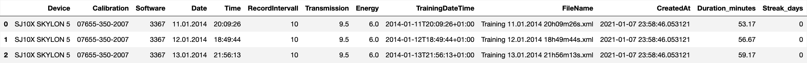
    


```python
describe_df(df_records.iloc[:,1:], 'records', use_columns=False, fig_offset=-4)
```

    🔵 *** df: records ***
    🟣 shape: (218_171, 7) columns: ['Pulse', 'Power', 'RPM', 'TimePassed_minutes', 'TimePassed_percent', 'Score_10sec', 'TrainingId'] 
    🟣 duplicates: 0
    🟣 missings: {'Pulse': 0, 'Power': 0, 'RPM': 0, 'TimePassed_minutes': 0, 'TimePassed_percent': 0, 'Score_10sec': 0, 'TrainingId': 0}
    --- column uniques (all)
    🟠 Pulse(182|int64)
    🟠 Power(52|int64)
    🟠 RPM(61|int64)
    🟠 TimePassed_minutes(443|float64)
    🟠 TimePassed_percent(23_272|float64)
    🟠 Score_10sec(1_029|float64)
    🟠 TrainingId(1_125|int64)
    --- column stats (numeric)
    🟠 Pulse(182|int64) min: 0 | max: 220 | median: 78.0 | mean: 65.203 | std: 64.223 | cv: 0.985 | sum: 14_225_458 | skew: 0.096 | kurto: -1.735
    🟠 Power(52|int64) min: 25 | max: 300 | median: 160.0 | mean: 160.233 | std: 23.28 | cv: 0.145 | sum: 34_958_190 | skew: -0.643 | kurto: 2.316
    🟠 RPM(61|int64) min: 14 | max: 89 | median: 54.0 | mean: 53.633 | std: 3.557 | cv: 0.066 | sum: 11_701_072 | skew: -0.818 | kurto: 6.298
    🟠 TimePassed_minutes(443|float64) min: 0.167 | max: 73.833 | median: 16.333 | mean: 16.916 | std: 10.766 | cv: 0.636 | sum: 3_690_485.0 | skew: 0.693 | kurto: 0.854
    🟠 TimePassed_percent(23_272|float64) min: 0.002 | max: 1.0 | median: 0.503 | mean: 0.503 | std: 0.289 | cv: 0.574 | sum: 109_648.0 | skew: -0.0 | kurto: -1.2
    🟠 Score_10sec(1_029|float64) min: 0.0 | max: 0.018 | median: 0.008 | mean: 0.007 | std: 0.001 | cv: 0.186 | sum: 1_610.97 | skew: -0.127 | kurto: 1.514
    🟠 TrainingId(1_125|int64) min: 1 | max: 1_128 | median: 521.0 | mean: 531.252 | std: 336.07 | cv: 0.633 | sum: 115_903_885 | skew: 0.088 | kurto: -1.243


    
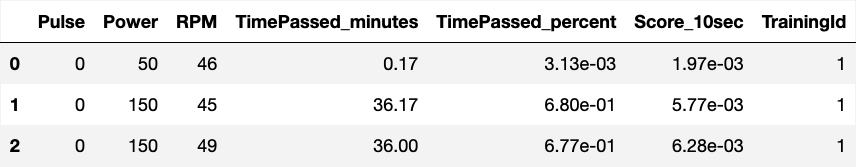
    


    
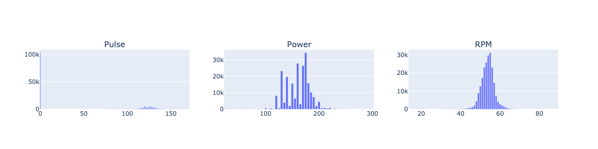
    


## enhance tables


```python
#
# * tailor and join both tables

# * id col is new index
if "Id" in df_training.columns:
    df_training.set_index("Id", inplace=True, drop=True)
if "Id" in df_records.columns:
    df_records.set_index("Id", inplace=True, drop=True)

# * convert to proper datetime (remove 'T')
df_training.TrainingDateTime = pd.to_datetime(
    df_training.TrainingDateTime, errors="coerce"
)

# * add daytime (3 cats: morning, day, evening)
df_training["daytime"] = df_training.TrainingDateTime.dt.hour.map(
    lambda x: "morning" if x < 13 else "day" if x < 18 else "evening"
)

# * add day_of_week
df_training["day_of_week"] = df_training.TrainingDateTime.dt.strftime("%A")

# * add date
df_training["training_date"] = df_training.TrainingDateTime.dt.date.astype("datetime64")

# * join both tables on records level
df = df_records.join(df_training, on="TrainingId")

# * drop unneeded columns: filename, createdat, TrainingId
cols_drop = [col for col in df if len(df[col].unique()) == 1]
print(f"remove these one-item columns:{cols_drop}")

cols_drop += ["Date", "Time", "FileName", "CreatedAt", "TrainingId"]

df.drop(
    # * subtract columns to make the statement idempotent
    columns=set(df.columns) & set(cols_drop),
    inplace=True,
)
df[:3]
```

    remove these one-item columns:['Device', 'Calibration', 'Software', 'RecordIntervall', 'Transmission', 'Energy']


    
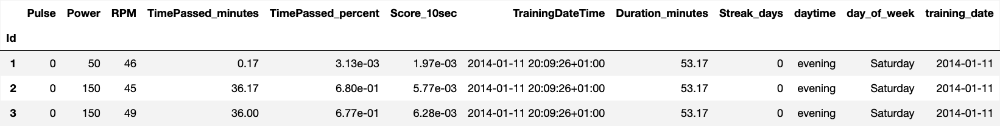
    


## duration


```python
_df = df_training.copy()
# * add aux cols for sorting
_df['_daytime'] = pd.Categorical(_df.daytime, ["morning", "day", "evening"])
_df['_year'] = _df.TrainingDateTime.dt.year

_fig = px.box(
    _df.sort_values(by=["_year","_daytime"]),
    y=_df.Duration_minutes,
    template=THEME_PLOTLY,
    color='daytime',
    points="outliers",
    # points=False,
    facet_col=_df.TrainingDateTime.dt.year,
    # height=300,
    width=1600,
    title="Training duration per daytime and year",
    )
_fig.show('png')
```


    
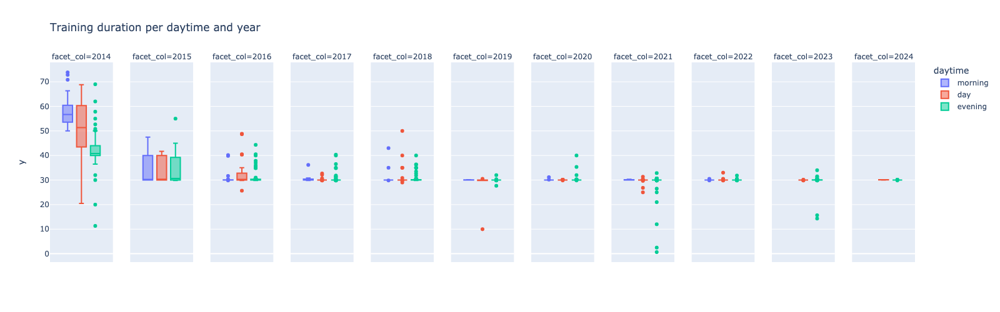
    


## streaks


```python
#
# * copy table, must be sorted by TrainingDateTime
_df = (
    df_training.sort_values("TrainingDateTime")
    .reset_index()
    [["Id", "training_date"]]
    .copy()
)

# * add bool for "is a sequence", check if delta to previous training is 1
_df['sequence'] = (_df['training_date'] - _df.shift(1)['training_date']).dt.days.astype('Int16').fillna(1) == 1
# _df['no_interruption_days'] = (_df['training_date'] - _df['training_date'].shift(1)).dt.days.fillna(1).ne(1).cumsum()

# * add section number. cumsum increases on a certain condition (when sequence is False, streak has ended)
_df['section'] = (~_df.sequence).cumsum()

# * fix edge case: very first section has no predessesor and belongs to first streak
_df.loc[1, 'section'] = 0

display(_df[:3])

# * calculate streak
df_training_streak=(_df.groupby(
    'section',
    as_index=False,     # only relevant for series output
    observed=False,     # speeds up processing for large data
    )
    .agg({
        'section':'count',
        'training_date':['min','max'],
        })
    .droplevel(axis=1, level=0)
    .rename(columns={'count':'streak_days', 'min':'start_date', 'max':'end_date'})
    .sort_values(by='streak_days', ascending=False)
    )
df_training_streak[:3]

```


    
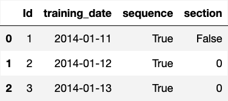
    


    
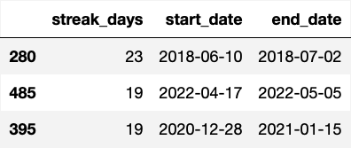
    


```python
_df = df_training_streak.copy()[:20]
_fig = px.bar(
    _df,
    y="streak_days",
    x=_df['end_date'].astype(str),
    # text='streak_days',
    width=1600,
    labels={"x": "end_date"},
    title="TOP 20 streaks (consecutive trainings)",
    template=THEME_PLOTLY,

)
_fig.update_layout(
    title={
        'x': 0.5,
        'y': 0.95,
        'xanchor': 'center',
        'yanchor': 'top',
        'font': {'size': 30, }
    },
    yaxis_range=[0, 25],
)
_fig.show('png')
_fig.write_image('img/top20streaks.png')


```


    
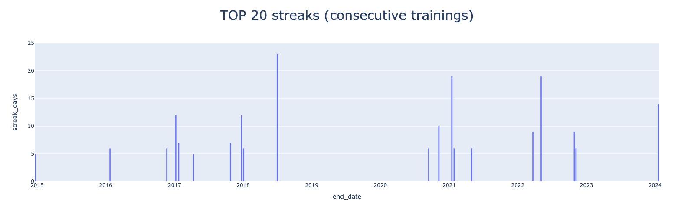
    


## aggregations


```python
df=(df_training
    .merge(
        df_records,
        left_on='Id',
        right_on='TrainingId',
    )
)
df['year']=df['TrainingDateTime'].dt.year
```


```python
df.groupby(
    'year',
    # as_index=False,
    ).agg({
        'training_date':['min', 'max','nunique'],
        'Duration_minutes':['min', 'max', 'mean'],
        'Power':['max', 'mean'],
        }
    )
```


    
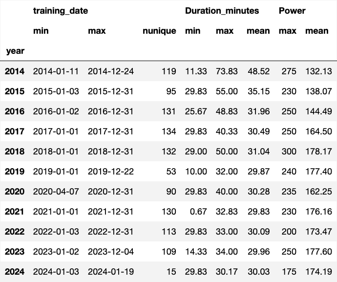
    


## numerics


```python
df=df_training.iloc[:,[8,11]]
df['year']=df['TrainingDateTime'].dt.year.astype(str)
_df1=df[df['year']<'2022'].iloc[:,[2,1]]
_df2=df.iloc[:,[2,1]]

```


```python
_df1=df[df['year']<'2024'].iloc[:,[2,1]]
plot_boxes(_df1,annotations=True, width=2000)
```


    
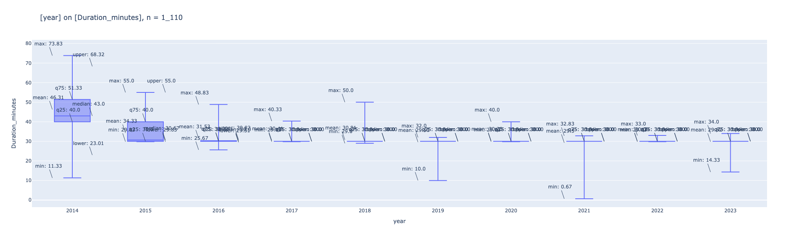
    


```python
# lol = px.data.iris()[["species", "sepal_width"]]
# plot_boxes(lol, "sepia", width=800, )
```


```python
plot_box(df_records['Power'], height=400, violin=True, caption='kettler')
```


    
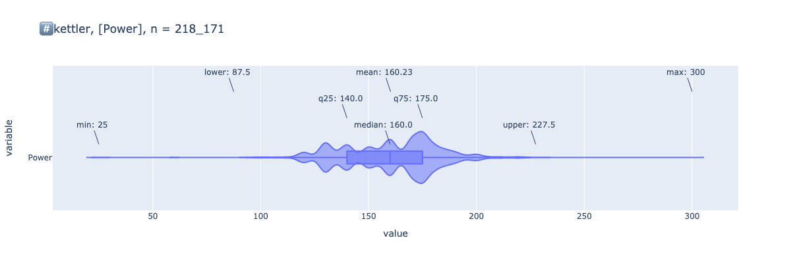
    


```python
plot_box(df_training['Duration_minutes'], height=400, violin=True, caption='kettler', points='all')
```


    
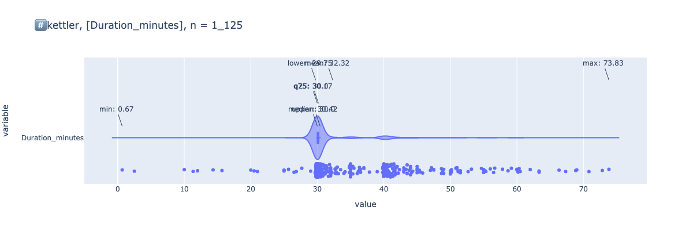
    


```python
plot_box(df_records['RPM'], height=400, violin=True, caption='kettler')
```


    
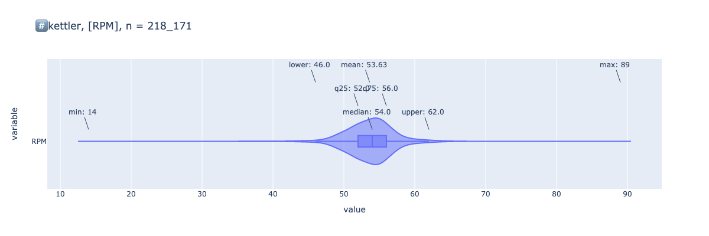
    

